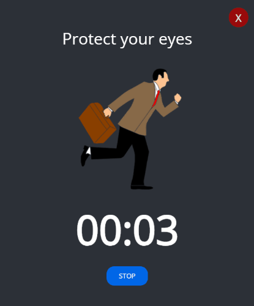

<p align="center">
</a>
</p>
<br>


# Electron

Window desktop application to help take care of your eyesight while working at a computer. 
It is an application with an interface created using HTML and CSS.

American opticians recommend that, for the health of our eyes, every 20 minutes we should stop working in front of the computer for 20 seconds and use this time to look at a distance greater than 20 feet (about 6 metres). The app is designed to help you follow this rule.

## Tech Stack

* [Electron](https://www.electronjs.org/)
* JavaScript
* HTML
* CSS

  
## Lessons

* design of the application according to UI standards
* use of Electron in practice
* use new libraries and develop skills in writing JS

  
## Run 

Start the app

```bash
  yarn start
```


## Step by step

- Run app.
- Click start.
- After the sound, take a break. 


## Authors

:woman: [@marcelaos](https://github.com/marcela-os)
